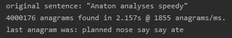

Anaton - A very fast anagram solver!
===
This is a very fast anagram solver meant to find either a lot of anagrams from smaller sentences or identify longer 
anagrams from slightly longer sentences.

# Installation
Pre-requisites: Python 3.7
```
pip install anaton
```

# Usage
When finding anagrams we need 2 things, a seed sentence and a word list to match up against. This package does come 
pre-shipped with a dictionary of 10,000 words, but you can use your own wordlist if you want to. Please note this 
library only supports english characters a-z

## Solve
It's pretty easy to get going!

```python
from anaton import solve

# Solve anagrams!
for chunk in solve('string to find anagrams from'):
    # The anagram solver will return several anagrams at a time, thus we have to iterate over the chunk returned
    for anagram in chunk:
        print(anagram)
```

Due to the nature of how the anagrams are found, the generator will return a list of very similar anagrams at a time.

If you want you can also restrict it to only find words with a specified minimum length using the `min_word_length` 
parameter

```python
from anaton import solve

# Solve anagrams!
for chunk in solve('string to find anagrams from', min_word_length=3):
    # The anagram solver will return several anagrams at a time, thus we have to iterate over the chunk returned
    for anagram in chunk:
        print(anagram)
```

## Dictionary
If you want to use a custom wordlist, you will need to instantiate your own dictionary object. The Dictionary is 
expecting your wordlist to already be sorted for performance reasons. If this is not the case, you can easily sort it 
on unix systems with this

```
sort wordlist.txt > wordlist.txt
```

To instantiate the Dictionary object just do this:

```python
from anaton import Dictionary

dictionary = Dictionary('path-to-file')
```

If you want to find anagrams for somewhat long string, you may want to filter the search space when loading in the 
dictionary, this can be done with the "filter_sentence" parameter

```python
from anaton import Dictionary

dictionary = Dictionary('path-to-file', filter_sentence='string to search within')
```

When you have instantiated the dictionary you can just pass it to the solver!

```python
from anaton import Dictionary, solve

dictionary = Dictionary('path-to-file')
anagram_generator = solve('string to search within', dictionary=dictionary)
```


# Example usage
A simple test of speed

```python
from anaton import solve
import time


if __name__ == '__main__':
    anagram = 'Anaton analyses speedy'
    print(f'original sentence: "{anagram}"')
    k = 0
    target = 4000000

    solve_generator = solve(anagram, min_word_length=2)
    start = time.time()
    for anagrams in solve_generator:
        k += len(anagrams)
        if k >= target:
            break

    timing = time.time() - start
    print(f'{k} anagrams found in {timing:.3f}s @ {k / timing / 1000:.0f} anagrams/ms.')
    print(f'last anagram was: {anagrams[0]}')

```

Which would generate an output likes this:


